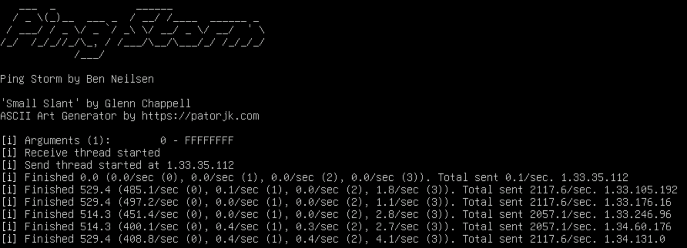

# IPv4 ping map
This program gathers IPv4 ICMP echo response data that may be used to create a heatmap of the global IPv4 address space.
Such an image would contain $2^{32}$ or 4.2 billion pixels.

## Limitations
Firstly, it is very important to recognize that ICMP is a connection-less datagram protocol which doesn't have the
guarantees that connection-oriented protocols have. There is no delivery guarantee and importantly no congestion control
or notification system. We won't receive messages to slow down our transmits and therefore our only notice that something
is wrong is when we stop receiving replies. There is no best way to detect this perfectly, but a good way seems to be: send 3 pings and
see how many addresses come back with only 1 response. If the number is high then packets are being dropped.

The kind of traffic this program sends is largely control plane. Each IP packet has 8 bytes of payload (size of ICMP header),
which is less than half the size of the header itself. Due to this, our bottleneck is going to be largely CPU-based, which
for most off-the-shelf routers, means its actual throughput is much lower than what it could achieve in theory.

## How it works
A socket is created with the `SOCK_DGRAM` and `IPPROTO_ICMP` options which requires your user to be in the range of `net.ipv4.ping_group_range`.
Two threads send and receive on this socket. The first sends `DATAGRAMS_PER_SEC` packets/sec and pings each IP address at least 3 times.
The second thread listens for any packets that arrive and marks them down in a memory-mapped file using bitwise arithmetic.

Regions marked as [reserved](https://en.wikipedia.org/wiki/IPv4#Special-use_addresses) are skipped over in the program.

To stop the program, common Unix signals to terminate a process are caught and flip a flag that the threads will use to stop executing early.

## Resources
I included citations to code where I deemed worthy. The rest comes from my university courses in systems and socket programming.
GenAI was not used to write any code for this program.
